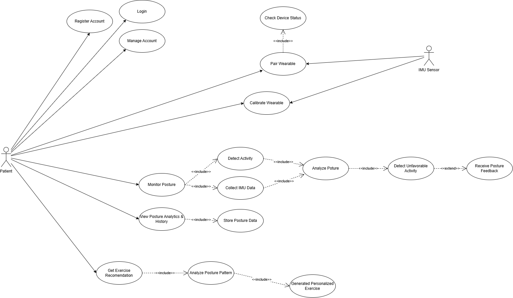
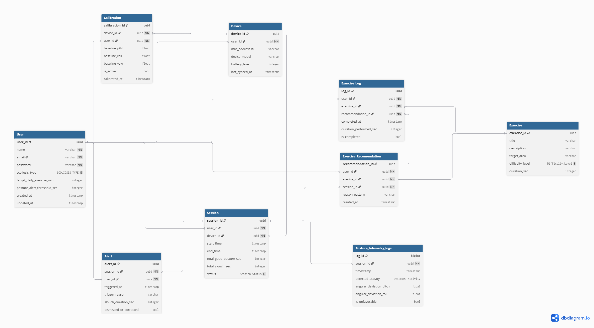
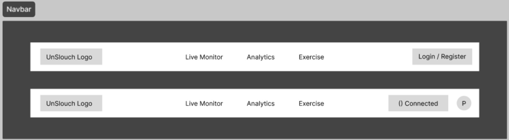
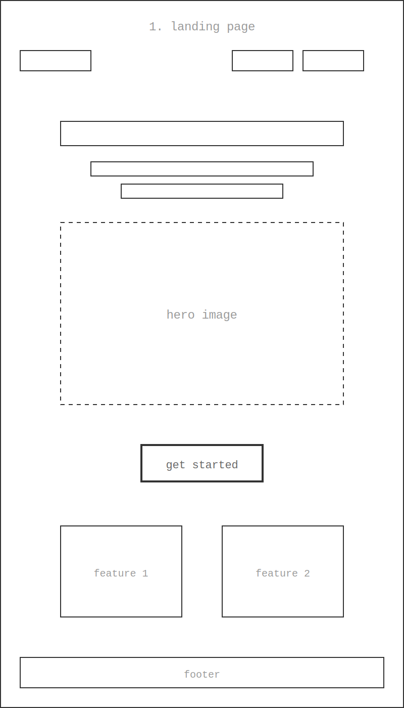
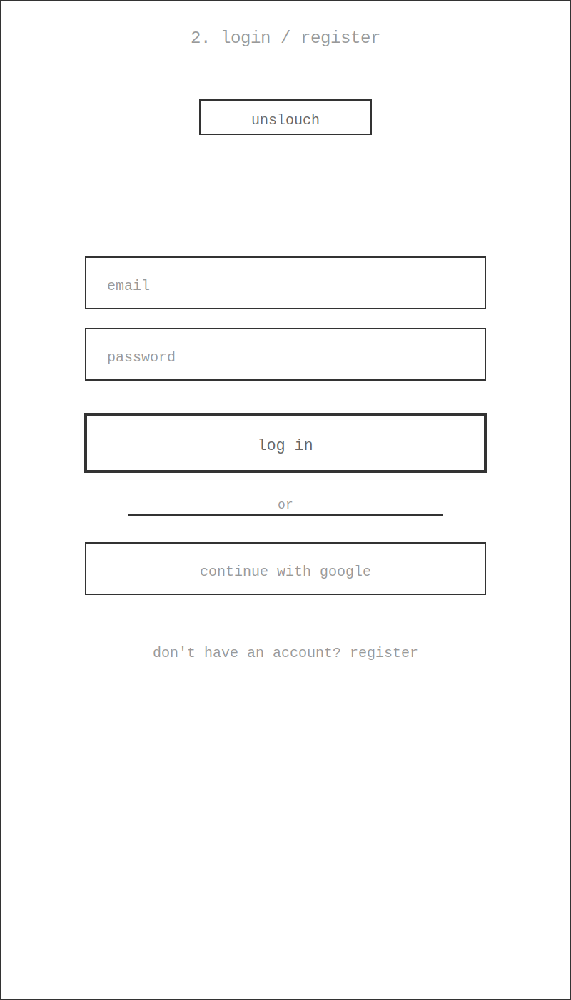
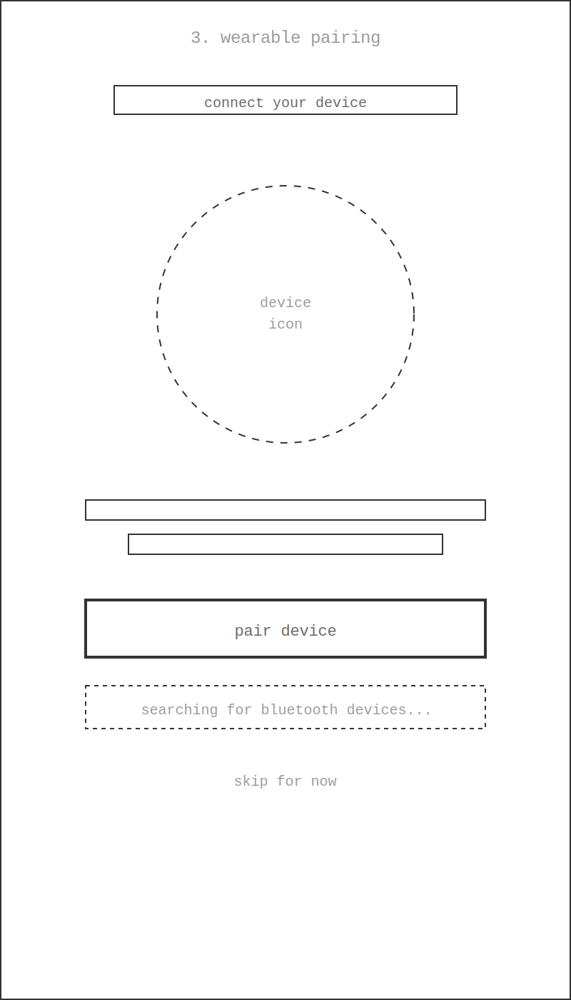
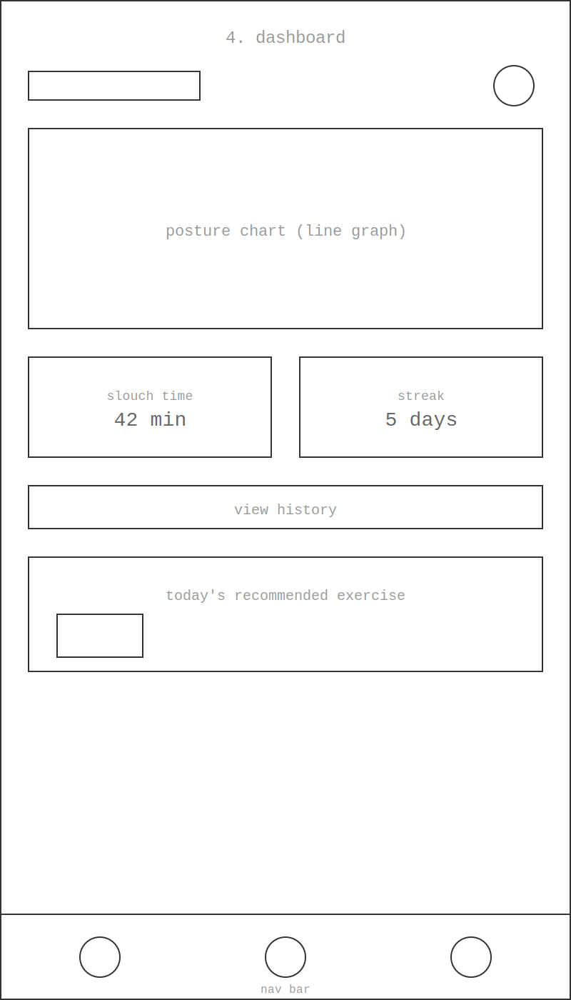
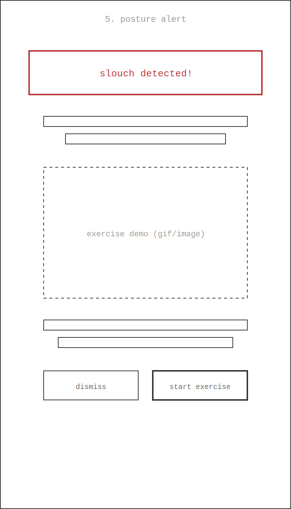
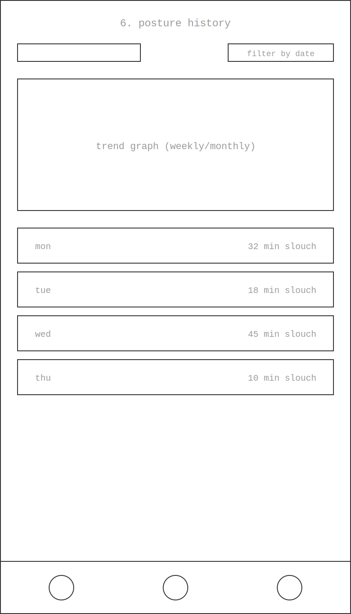

# Unslouch

Wearable posture-monitoring system for scoliosis rehabilitation and everyday postural awareness.

## Group information

- Group name: JOMA
- Josh Jovancio - 536680
- Aurellia Safa Madrim - 546878
- Musa Hanif Moeljawan - 533080

## Project overview

IT Senior Project  
Department of Electrical and Information Engineering, Faculty of Engineering, Universitas Gadjah Mada

Unslouch is a wearable sensor-based solution designed to monitor spinal angle and help prevent further back pain. The system tracks posture in real time and provides feedback to improve alignment and rehabilitation consistency.

## Problem

Scoliosis is a chronic musculoskeletal condition affecting posture, movement, and quality of life. Traditional rehabilitation often fails because patients do not consistently maintain exercises and posture awareness outside clinical settings. Existing posture devices also often provide simple alerts without personalized adaptation.

## Solution

Unslouch combines wearable sensing, activity recognition, and AI-assisted analysis to detect unhealthy posture patterns and provide real-time guidance. It supports movement-break prompts, personalized exercise recommendations, and long-term habit tracking.

## Competitor analysis

### 1. Garmin Smart Watches
- Indirect competitor
- Strong ecosystem and brand trust
- Limited spinal measurement accuracy from wrist-based sensors

### 2. Generic Smart Sensor Posture Belt
- Direct competitor
- Very low cost but uncomfortable and unsophisticated
- Lacks data logging and individualized insights

### 3. Upright Go
- Direct competitor
- Compact and app-enabled
- More expensive and less localized for Indonesian users

## Summary

Unslouch aims to provide an accessible, affordable, and intelligent posture-monitoring wearable that helps patients improve adherence, detect harmful patterns, and support rehabilitation outside the clinic.

## SDLC Methodology

**Methodology used:** Agile – Scrumban (Scrum and Kanban hybrid)

**Reasons for choosing this methodology:**
- **Balances Deadlines with Hardware Flexibility:** Uses Scrum's 2-week sprints to hit the 12-week semester deadline while leveraging Kanban's continuous flow to handle upcoming tasks
- **Cross-Disciplinary Visibility:** Tracks wearable hardware, firmware, and web app tasks side-by-side on a single board to prevent integration bottlenecks
- **Work-In-Progress (WIP) Limits:** Caps active tasks to avoid scope creep and ensure team members finish existing features before starting new ones
- **Agile Algorithm Calibration:** Allows quick re-prioritization on the board when testing posture-tracking logic without disrupting fixed software deliverables

## Product Goals

To develop an AI-assisted posture monitoring system that uses an IMU wearable to detect and analyze users' posture in real time and provide personalized exercise recommendations based on their posture data.

Specific goals:
- Collect posture and movement data from the IMU wearable during daily activities such as sitting, standing, walking, and bending
- Analyze the collected sensor data to identify potentially unfavorable posture patterns rather than relying solely on fixed-angle thresholds
- Use the user's posture history and detected patterns to recommend appropriate corrective exercises
- Store posture data in the cloud so users can view their posture patterns and changes over time
- Provide feedback when an unfavorable posture is detected and persists for a defined period
- (If possible) Allow physiotherapists to review a patient's posture history and use the collected information to support their evaluation and exercise guidance

## Potential Users and Their Needs

The **patient** is the primary user of Unslouch.

Needs:
- Monitor posture without manually entering data
- Receive feedback when poor posture is detected
- Understand their posture patterns over time
- Receive exercise recommendations based on their detected posture problems
- View their exercise/posture progress
- Use the system conveniently during normal daily activities

Physiotherapists may be considered secondary users in future development, particularly for monitoring patient progress and reviewing posture data.

## Use Case Diagram

## Functional Requirements

| FR | Function | Description |
|----|----------|--------------|
| FR1 | Account Registration | The system shall allow a patient to create a new account by providing the required personal information and login credentials |
| FR2 | Authentication & Session | Enable authenticated access for registered users, validating credentials securely, and managing session tokens throughout active user periods |
| FR3 | Manage Account | The system shall allow patients to view and update their account and personal information |
| FR4 | Wearable Pairing | The system shall allow patients to connect and pair their IMU wearable with the Unslouch system via Web Bluetooth or local sync protocol |
| FR5 | Check Device Status | The system shall display the connection and operational status (such as battery levels) of the paired IMU wearable |
| FR6 | Calibrate Wearable | The system shall allow patients to calibrate the IMU wearable to establish the patient's initial posture reference and prevent false alarms |
| FR7 | IMU Telemetry Ingestion | The system shall continuously stream body orientation, angular velocity, and acceleration data from the IMU hardware |
| FR8 | Activity Recognition | The AI engine shall classify user activities in real time into distinct states: sitting, standing, walking, and bending |
| FR9 | Contextual Posture Analysis | The AI engine shall analyze spinal deviation relative to the calibrated baseline within the context of the current detected activity |
| FR10 | Real-Time Biofeedback Alerts | When an unfavorable posture deviation persists beyond a defined duration threshold, the system shall trigger an immediate biofeedback alert |
| FR11 | Data Persistence | The system shall batch and securely store continuous posture sessions, classified activities, and alert events in the cloud database |
| FR12 | Posture Analytics & History | The system shall provide dashboards displaying daily posture summaries, total slouch duration, posture trends over time, and activity breakdown charts |
| FR13 | Pattern Analysis & Exercise Recommendation | The system shall analyze historical posture patterns to generate personalized Physiotherapy Scoliosis-Specific Exercises (PSSE), stretches, or movement breaks |
| FR14 | Exercise Adherence & Progress Tracking | The platform shall track and record user completion of recommended rehabilitation exercises to measure long-term compliance |

## Entity Relationship Diagram

## Low-Fidelity Wireframes

## Gantt Chart

| Activity | 1 | 2 | 3 | 4 | 5 | 6 | 7 | 8 | 9 | 10 | 11 | 12 |
|---|:---:|:---:|:---:|:---:|:---:|:---:|:---:|:---:|:---:|:---:|:---:|:---:|
| **Planning** | | | | | | | | | | | | |
| – Source hardware | 🟦 | 🟦 | 🟦 | 🟦 | | | | | | | | |
| – Repo and environment setup | 🟦 | 🟦 | 🟦 | 🟦 | | | | | | | | |
| **Requirement Analysis** | | | | | | | | | | | | |
| – Finalize FR1–FR14 | | 🟦 | 🟦 | 🟦 | | | | | | | | |
| **Software Design** | | | | | | | | | | | | |
| – Lo-Fi wireframe | | | 🟦 | 🟦 | 🟦 | 🟦 | | | | | | |
| – DB schema and AI architecture | | | 🟦 | 🟦 | 🟦 | 🟦 | | | | | | |
| **Software Development** | | | | | | | | | | | | |
| – Web Bluetooth and IMU stream | | | | 🟦 | 🟦 | 🟦 | 🟦 | 🟦 | 🟦 | | | |
| – AI engine and real-time alert | | | | 🟦 | 🟦 | 🟦 | 🟦 | 🟦 | 🟦 | | | |
| **Testing** | | | | | | | | | | | | |
| – Calibration routine | | | | | | | | 🟦 | 🟦 | | | |
| – Engine validation | | | | | | | | 🟦 | 🟦 | | | |
| – End-to-end integration testing | | | | | | | | 🟦 | 🟦 | | | |
| **Deployment** | | | | | | | | | | | | |
| – GitHub Pages production build | | | | | | | | | | 🟦 | 🟦 | |
| – CI/CD automation | | | | | | | | | | 🟦 | 🟦 | |
| **Maintenance** | | | | | | | | | | | | |
| – Bug fixes and alert tuning | | | | | | | | | | | 🟦 | 🟦 |
| – Final report and presentation | | | | | | | | | | | 🟦 | 🟦 |